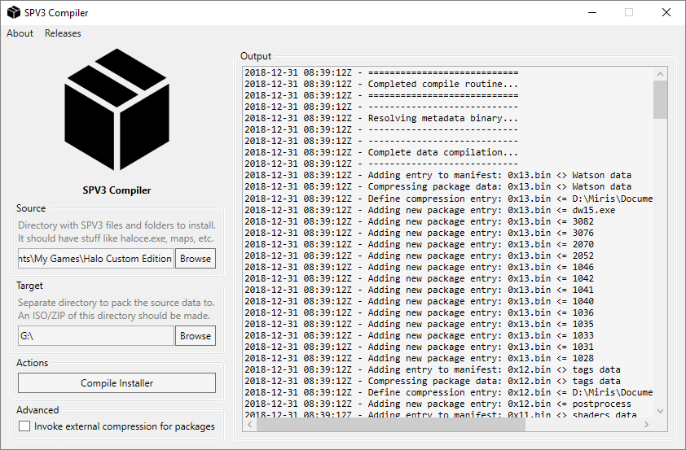

<html>
    <h1 align="center">
        SPV3.Installer
    </h1>
    

        Compiler & installer specification for SPV3.2
    

</html>

# Introduction

The SPV3.Installer project is designed to be a flexible and reliable successor
to the original SPV3 installer.

This repository contains the source code and specification for the SPV3.2
compiler & installer.

In this context, compilation means:

- compressing all of the SPV3/HCE core & data files to DEFLATE packages;
- generating a manifest file for the installer to use for installing packages;

In this context, installation means:

- backing up of any SPV3 data that may already exist on the file system; and
- the extraction of the SPV3 packages to the directory specified by the user.

Prior to extraction, the installation directory is checked for files that belong
to the packages. Any files that exist will be moved to a backup subdirectory in
the installation directory.

Once the backup routine is finished, each package will then be extracted to the
installation directory.

# Compiler

The SPV3 Compiler's objective is to facilitate the compression of the SPV3 data
into packages, and to generate a manifest file for the packages.

These packages are used by the SPV3 Installer to install the SPV3 files to the
end-user's computer.

## Usage

In the GUI, specify your source & target directory, then click the button and
wait for the compilation to finish. During this time, you might see brief
command lines popping up. Rest assured that this is expected, and nothing tragic
should happen!

## Directories

The compiler deals with two directories:

**Source**: In a nutshell, the directory you choose will end up being what the
SPV3 Installer will end up installing to the end-user's system.
  
This directory should contain the HCE & SPV3 data. In this context, data refers
to the HCE executable, OS libraries, SPV3 maps and equivalent files.
          
**Target**: The installation packages will be created in this directory. No
special requirements here!

Ideally, it should be a directory that will be distributed as an ISO/ZIP. With
this in mind, it should only contain SPV3-related installation files (the
installer & packages), and documents such as a changelog and readme.

# Entities

## Manifest

A manifest file is a persistent representation of all the packages that the SPV3
Installer should handle. It documents the files belonging to each package, and
the backup directory.

The manifest file is created by:

1. Serialising an Installer instance into an XML equivalent.
2. Computing the UTF8 bytes representation of the XML string.
3. Compressing said UTF8 bytes using the DEFLATE algorithm.

The manifest is expected to be called `0x00.bin` on the filesystem.

## Packages

A package is a DEFLATE archive with the SPV3 data that should be installed. They
are identified by the `0x` prefix, and the `.bin` extension. 

Conventionally, each package represents either a subdirectory, or the core files
belonging to HCE or SPV3.

The core package is named `0x01.bin`, and the subdirectory packages have their
own numbers. 

## Entry

An Entry is a member of the Package entity. It is effectively a file in the
archive on the filesystem. Entries are comprised of:

- Name: The identifier of the entry, which matches the file/directory it
  represents.
- Type: The kind of filesystem record (i.e. file or directory) the entry
  represents.

Entries are used by the  library to determine which files should be backed up
prior to installing SPV3.