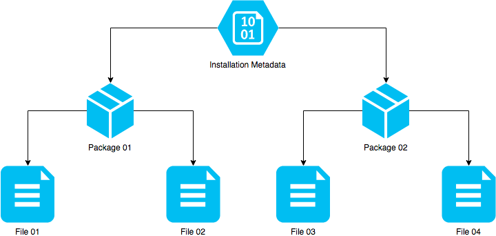

# Specification

The SPV3.Installer project is designed to be a flexible and reliable successor
to the original SPV3 installer. This document specifies each entity that belongs
to this domain.

The following diagram visualises the hierarchy of the entities in this domain:

- [Installation](#installation)
- [Manifest](#manifest)
- [Package](#package)
- [File](#file)

## Installation

In this context, installation means:

- backing up of any SPV3 data that may already exist on the file system; and
- the extraction of the SPV3 packages to the directory specified by the user.

Prior to extraction, the installation directory is checked for files that belong
to the packages. Any files that exist will be moved to a backup subdirectory in
the installation directory.

Once the backup routine is finished, each package will then be extracted to the
installation directory.

For actually creating the installation packages & manifest, please refer to the
[Compilation](compilation.md)] document.

## Manifest

A manifest file is a persistent representation of all the packages that the SPV3
Installer should handle. It documents the files belonging to each package, and
the backup directory.

The manifest file is created by:

1. Serialising an Installer instance into an XML equivalent.
2. Computing the UTF8 bytes representation of the XML string.
3. Compressing said UTF8 bytes using the DEFLATE algorithm.

The manifest is expected to be called `0x00.bin` on the filesystem.

## Package

A package is a DEFLATE archive with the SPV3 data that should be installed. They
are identified by the `0x` prefix, and the `.bin` extension. 

Conventionally, each package represents either a subdirectory, or the core files
belonging to HCE or SPV3.

The core package is named `0x01.bin`, and the subdirectory packages have their
own numbers. 

## Entry

An Entry is a member of the [Package](#package) entity. It is effectively a file
in the archive on the filesystem. Entries are comprised of:

- Name: The identifier of the entry, which matches the file/directory it
  represents.
- Type: The kind of filesystem record (i.e. file or directory) the entry
  represents.

Entries are used by the  library to determine which files should be backed up
prior to installing SPV3.